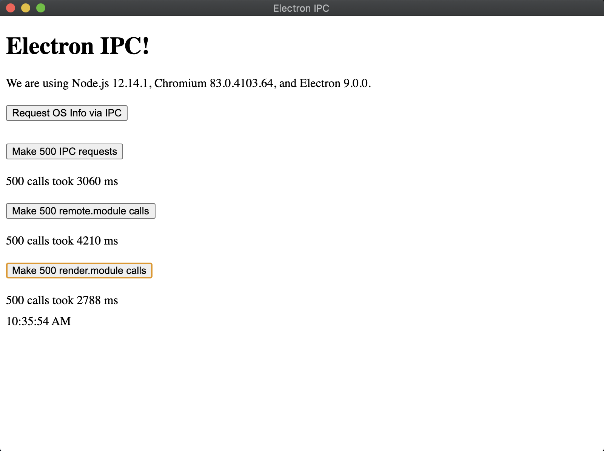

# Electron IPC request/response with .invoke()

Aim to provide a generic IPC request/response architecture to access a custom native addon hosted in the Electron main process on the Electron renderer (UI) process

## Resources

- Invoke https://www.electronjs.org/docs/api/ipc-renderer#ipcrendererinvokechannel-args
- Invoke PR https://github.com/electron/electron/pull/18449
- IPC response architecture with TypeScript https://blog.logrocket.com/electron-ipc-response-request-architecture-with-typescript/
- Structured clone https://developer.mozilla.org/en-US/docs/Web/API/Web_Workers_API/Structured_clone_algorithm
- Remote module harmful https://medium.com/@nornagon/electrons-remote-module-considered-harmful-70d69500f31
- Magic properties https://github.com/electron/electron/blob/11cd0db86b5207160d05d831a7143bc479fce54f/lib/browser/remote/server.js#L87 (Don't work for Promises)
- Remote module property getter (blocking main thread): https://github.com/electron/electron/blob/v9.0.0/lib/renderer/api/remote.js#L150

## TypeScript decorators

- https://www.typescriptlang.org/docs/handbook/decorators.html
- https://codeburst.io/decorate-your-code-with-typescript-decorators-5be4a4ffecb4
- https://blog.wizardsoftheweb.pro/typescript-decorators-reflection/
